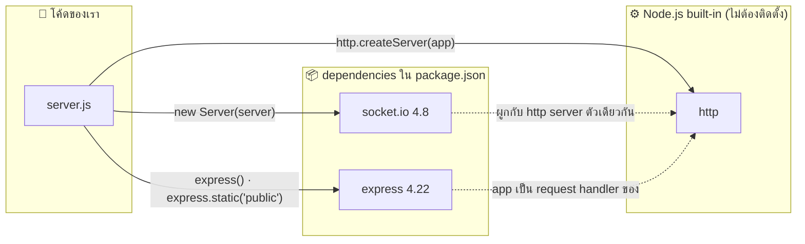
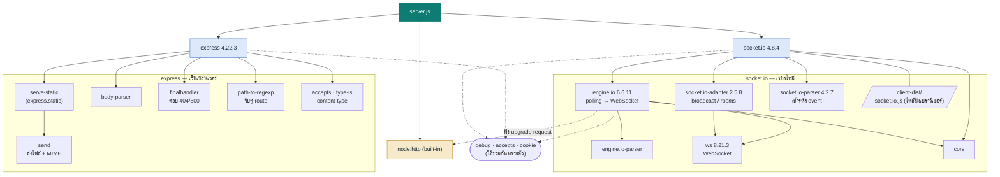
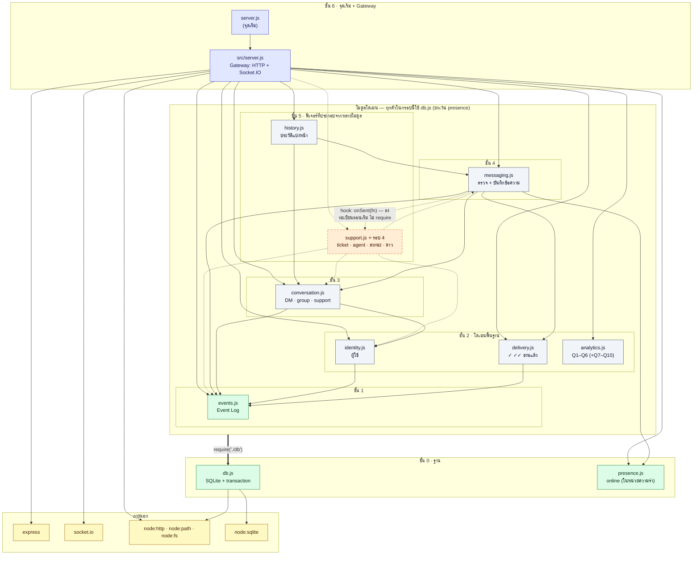

# Sapol Chat — Package Dependency Diagram (Backend)

> โค้ด BE = `server.js` · เวอร์ชันจาก `node_modules` ที่ติดตั้งจริง (26 ก.ย. 2026)
> ติดตั้งตรง 2 package → ดึงแพ็กเกจย่อยมาทั้งหมด 78 ตัวใน `node_modules`

## 1. ภาพรวม (ระดับที่เราเรียกใช้เอง)



## 2. แบบละเอียด (แพ็กเกจย่อยที่สำคัญ)



## 3. อธิบาย

| Package | ประเภท | ใช้ทำอะไรในโปรเจกต์นี้ |
|---|---|---|
| `http` | built-in ของ Node.js | สร้างเซิร์ฟเวอร์ที่ทั้ง Express และ Socket.IO ใช้ร่วมกันบนพอร์ต 3000 |
| `express` | direct | `express.static('public')` เสิร์ฟ `index.html` (ผ่าน `serve-static` → `send`) |
| `socket.io` | direct | จัดการ event `join`, `chat`, `typing` และส่งไฟล์ `/socket.io/socket.io.js` ให้เบราว์เซอร์ |
| `engine.io` | transitive | ชั้นขนส่งข้อมูลจริง เริ่มด้วย HTTP polling แล้วอัปเกรดเป็น WebSocket |
| `ws` | transitive | ไลบรารี WebSocket ระดับล่าง |
| `socket.io-adapter` | transitive | ทำ `io.emit` และ `socket.broadcast.emit` (ส่งหาทุกคน / ทุกคนยกเว้นตัวเอง) |
| `socket.io-parser` | transitive | แปลง event + ข้อมูลเป็นแพ็กเก็ตและกลับคืน รวมถึง callback ของ `join` |

**ข้อสังเกต**

- เราเรียกใช้ตรงแค่ 3 ตัว (`express`, `socket.io`, `http`) ที่เหลือเป็น transitive dependency ที่ npm ติดตั้งให้อัตโนมัติ
- Express ติดตั้งแพ็กเกจย่อยมาหลายตัว (เช่น `body-parser`, `qs`, `cookie`) แต่โปรเจกต์นี้ใช้จริงแค่ส่วนเสิร์ฟไฟล์ static
- ถ้าวันหนึ่งไม่อยากใช้ Express ก็เสิร์ฟ `index.html` ด้วย `http` + `fs` เองได้ แต่ Socket.IO ยังจำเป็นสำหรับแชท

**ตรวจเองได้ด้วยคำสั่ง**

```bash
npm ls              # เฉพาะ dependency ตรง
npm ls --all        # ทั้งต้นไม้
npm explain ws      # ใครดึง ws เข้ามา
```

---

# ภาค 2 — Module Dependency Diagram ของโค้ด BE (PDCA รอบ 3 → 4)

> อัปเดต 26 ก.ย. 2026 · ได้จากการอ่าน `require(...)` ในทุกไฟล์ `src/*.js` จริง
> เส้นทึบ = มีอยู่แล้ว (รอบ 3) · กรอบ/เส้นประสีส้ม = จะเพิ่มในรอบ 4 (`PLAN-R4.md`)

## 4. แผนภาพแบบชั้น (Layer)

ลูกศร `A --> B` = "A เรียกใช้ B" · ทุกลูกศรชี้ **ลงล่าง** เท่านั้น (ไม่มีวงวน) · ลูกศรหนาจากกรอบโมดูลโดเมนไป `db.js` แทนการ require db ของทุกโมดูลในกรอบ

ภาพที่เรนเดอร์แล้ว: `docs/be-dependency-diagram.png`



> เส้นประ `messaging ⇢ support` ไม่ใช่การ `require` — ถ้า `messaging.js` require `support.js` ตรง ๆ จะเกิด **วงวน** (support → messaging → support) จึงใช้วิธีให้ `support.js` ลงทะเบียน callback ผ่าน `messaging.onSent(fn)` แทน ทิศการพึ่งพาจึงยังชี้ลงล่างทางเดียว

## 5. ตารางการพึ่งพา (ใครเรียกใคร)

| โมดูล | เรียกใช้ (ขาออก) | ถูกเรียกโดย (ขาเข้า) | ชั้น |
|---|---|---|---|
| `db.js` | node:sqlite, fs, path | ทุกโมดูลที่เก็บข้อมูล (8) | 0 |
| `presence.js` | – | server, messaging | 0 |
| `events.js` | db | server, identity, conversation, delivery, messaging, *support* | 1 |
| `identity.js` | db, events | server, conversation, *support* | 2 |
| `delivery.js` | db, events | server, messaging | 2 |
| `analytics.js` | db | server | 2 |
| `conversation.js` | db, identity, events | server, messaging, history, *support* | 3 |
| `messaging.js` | db, conversation, presence, delivery, events | server, history, *support* | 4 |
| `history.js` | db, conversation, messaging | server | 5 |
| *`support.js`* ⭐ | *db, conversation, messaging, identity, events* | *server* | 5 |
| `src/server.js` | ทุกโมดูล + express, socket.io, http, path | server.js, test | 6 |

## 6. ข้อสังเกต

- **ไม่มีวงวน (cycle)** — ชั้นล่างไม่รู้จักชั้นบน จึงทดสอบ `db`, `events`, `identity` แยกได้ง่าย
- **`db.js` ถูกใช้มากที่สุด** (Afferent = 8) → แก้ schema/migration ต้องระวังที่สุด เป็นเหตุผลที่แผนรอบ 4 ให้สำรองฐานข้อมูลก่อน
- **`src/server.js` พึ่งพามากที่สุด** (Efferent = 12) เป็นเรื่องปกติของ Gateway ที่ทำหน้าที่ต่อสายอย่างเดียว ไม่ควรมี business logic
- **`support.js` ต่อยอดโดยไม่ต้องให้ใครพึ่งพามัน** (ยกเว้น Gateway) → ถอดออกได้ทั้งโมดูลโดยแชทยังทำงานปกติ
- `presence.js` เก็บในหน่วยความจำ ไม่แตะฐานข้อมูล → ถ้าวันหนึ่งรันหลาย server ต้องย้ายไปใช้ Redis/adapter
