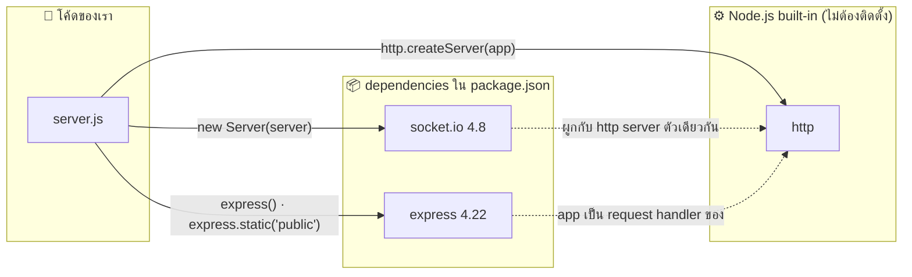

# Sapol Chat — Package Dependency Diagram (Backend)

> โค้ด BE = `server.js` · เวอร์ชันจาก `node_modules` ที่ติดตั้งจริง (26 ก.ย. 2026)
> ติดตั้งตรง 2 package → ดึงแพ็กเกจย่อยมาทั้งหมด 78 ตัวใน `node_modules`

## 1. ภาพรวม (ระดับที่เราเรียกใช้เอง)



## 2. แบบละเอียด (แพ็กเกจย่อยที่สำคัญ)


## 3. อธิบาย

| Package | ประเภท | ใช้ทำอะไรในโปรเจกต์นี้ |
|---|---|---|
| `http` | built-in ของ Node.js | สร้างเซิร์ฟเวอร์ที่ทั้ง Express และ Socket.IO ใช้ร่วมกันบนพอร์ต 3000 |
| `express` | direct | `express.static('public')` เสิร์ฟ `index.html` (ผ่าน `serve-static` → `send`) |
| `socket.io` | direct | จัดการ event `join`, `chat`, `typing` และส่งไฟล์ `/socket.io/socket.io.js` ให้เบราว์เซอร์ |
| `engine.io` | transitive | ชั้นขนส่งข้อมูลจริง เริ่มด้วย HTTP polling แล้วอัปเกรดเป็น WebSocket |
| `ws` | transitive | ไลบรารี WebSocket ระดับล่าง |
| `socket.io-adapter` | transitive | ทำ `io.emit` และ `socket.broadcast.emit` (ส่งหาทุกคน / ทุกคนยกเว้นตัวเอง) |
| `socket.io-parser` | transitive | แปลง event + ข้อมูลเป็นแพ็กเก็ตและกลับคืน รวมถึง callback ของ `join` |

**ข้อสังเกต**

- เราเรียกใช้ตรงแค่ 3 ตัว (`express`, `socket.io`, `http`) ที่เหลือเป็น transitive dependency ที่ npm ติดตั้งให้อัตโนมัติ
- Express ติดตั้งแพ็กเกจย่อยมาหลายตัว (เช่น `body-parser`, `qs`, `cookie`) แต่โปรเจกต์นี้ใช้จริงแค่ส่วนเสิร์ฟไฟล์ static
- ถ้าวันหนึ่งไม่อยากใช้ Express ก็เสิร์ฟ `index.html` ด้วย `http` + `fs` เองได้ แต่ Socket.IO ยังจำเป็นสำหรับแชท

**ตรวจเองได้ด้วยคำสั่ง**

```bash
npm ls              # เฉพาะ dependency ตรง
npm ls --all        # ทั้งต้นไม้
npm explain ws      # ใครดึง ws เข้ามา
```
