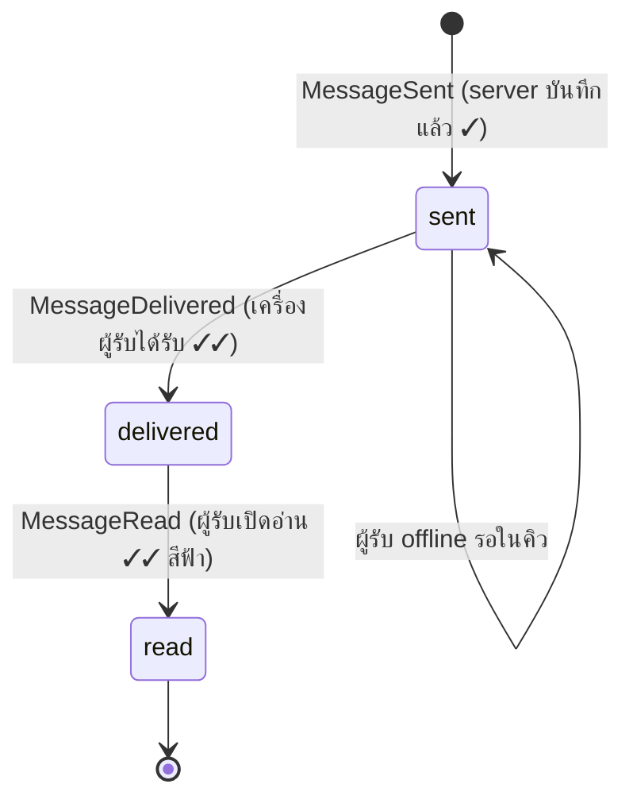
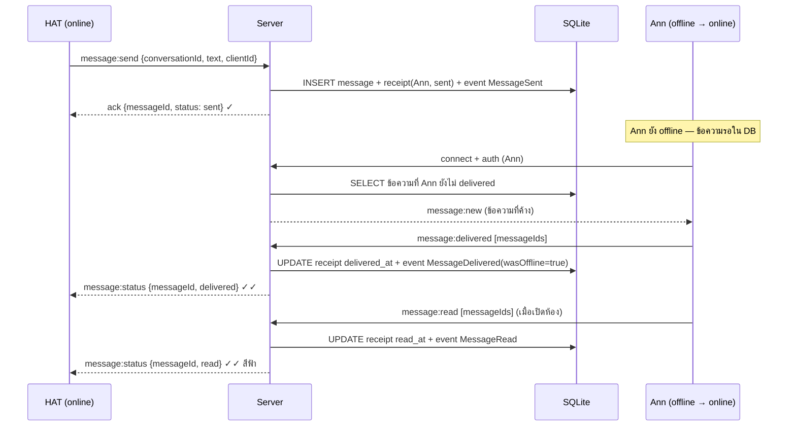
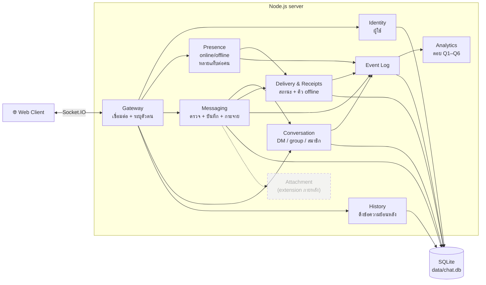
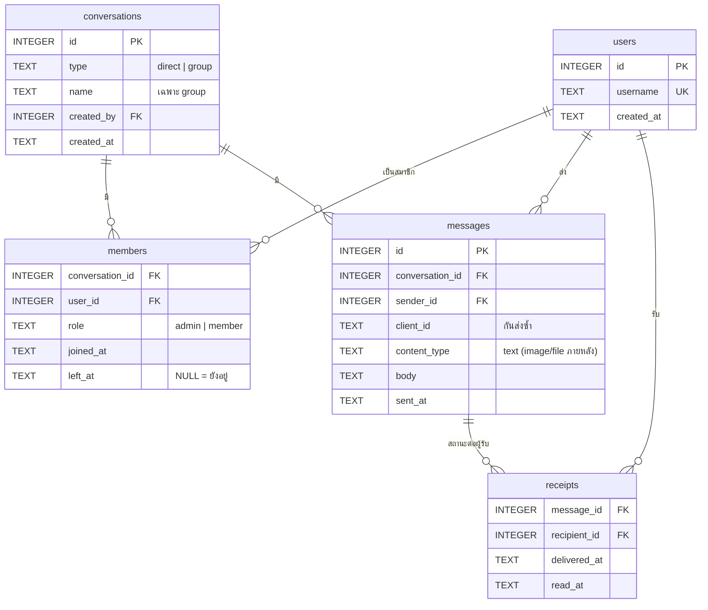

# Sapol Chat System — แผน PDCA รอบที่ 3 (P)

> 26 ก.ย. 2026 · ต่อจากรอบที่ 2 (`PLAN-R2.md`) · สถานะ: **Plan** (รออนุมัติก่อน Do)
> แนวทางออกแบบ: **Business Questions → Domain Events → Logical Components**

---

## 0. โจทย์ที่ได้รับเพิ่ม

| # | ความต้องการ | ผลต่อระบบเดิม |
|---|---|---|
| R1 | ส่ง/รับข้อความแบบ 1:1 | จากห้องเดียว → มีหลาย "conversation" |
| R2 | สร้าง group chat และเพิ่ม/ลบสมาชิก | ต้องมีข้อมูลสมาชิกของแต่ละกลุ่ม |
| R3 | ดู conversation history | ต้องเก็บข้อความถาวร (เดิมเก็บในหน่วยความจำ ปิด server แล้วหาย) |
| R4 | แสดงสถานะ `sent / delivered / read` | ต้องมีการตอบรับ (receipt) จากฝั่งผู้รับ |
| R5 | ส่งข้อความตอนอีกฝ่าย offline ได้ | ต้องมีคิวข้อความค้างส่ง และส่งให้เมื่อกลับมา online |
| R6 | รองรับ text ก่อน ส่วนรูป/ไฟล์เป็น extension | ออกแบบข้อความให้มี `type` เผื่อไว้ แต่ยังไม่ทำ |

**ผลที่ตามมา:** ระบบต้อง "จำ" ผู้ใช้และข้อความได้ข้ามการเชื่อมต่อ จึงต้องมี **ฐานข้อมูล** และ **ตัวตนผู้ใช้ที่คงที่** (username เดิม = คนเดิม)

---

## 1. Business Questions → ตัวชี้วัด

เริ่มจากคำถามที่ธุรกิจอยากรู้ แล้วนิยามให้วัดได้จริง

| # | คำถาม | นิยามที่วัดได้ (Metric) | ต้องรู้เหตุการณ์อะไร |
|---|---|---|---|
| Q1 | มีข้อความถูกส่งกี่ข้อความต่อวัน? | จำนวน `MessageSent` จัดกลุ่มตามวัน | MessageSent |
| Q2 | DAU/MAU ของ chat เป็นเท่าไร? | DAU = ผู้ใช้ไม่ซ้ำที่ **ส่งหรืออ่าน** ข้อความในวันนั้น · MAU = ย้อนหลัง 30 วัน · Stickiness = DAU ÷ MAU | MessageSent, MessageRead, UserConnected |
| Q3 | ห้องไหน active ที่สุด? | จำนวนข้อความ และจำนวนผู้ส่งไม่ซ้ำ ต่อ conversation ในช่วงเวลาที่เลือก | MessageSent |
| Q4 | message delivery latency เป็นเท่าไร? | `delivered_at − sent_at` ต่อผู้รับ รายงาน **p50 / p95** แยก "ผู้รับ online" กับ "ผู้รับ offline" | MessageSent, MessageDelivered |
| Q5 | มีข้อความกี่ % ที่ส่งไม่สำเร็จ? | `MessageSendFailed ÷ (MessageSent + MessageSendFailed)` · และ % ที่ค้าง undelivered เกิน 24 ชม. | MessageSendFailed, MessageSent, MessageDelivered |
| Q6 | user อ่านข้อความหลังได้รับโดยเฉลี่ยกี่วินาที? | `read_at − delivered_at` ต่อผู้รับ (เฉลี่ยและ p50) | MessageDelivered, MessageRead |

> ข้อตกลง: DAU นับเฉพาะคนที่ "ใช้แชทจริง" (ส่งหรืออ่าน) ไม่ใช่แค่เปิดหน้าเว็บ — ถ้าอยากนับแบบกว้างให้เปลี่ยนเป็น `UserConnected`

---

## 2. Domain Events

เหตุการณ์ทางธุรกิจที่เกิดขึ้นแล้ว (ชื่อเป็นอดีตกาล) — บันทึกลงตาราง `events` แบบเพิ่มอย่างเดียว (append-only) เพื่อใช้ตอบคำถามข้อ 1

| Event | เกิดเมื่อ | ข้อมูลสำคัญ | ตอบคำถาม |
|---|---|---|---|
| `UserRegistered` | ผู้ใช้ใหม่ใช้ชื่อครั้งแรก | userId, username | – |
| `UserConnected` | ผู้ใช้ online (แท็บแรก) | userId | Q2 |
| `UserDisconnected` | ผู้ใช้ offline (ปิดแท็บสุดท้าย) | userId | – |
| `ConversationCreated` | สร้าง DM หรือ group | conversationId, type (`direct`/`group`), createdBy, memberIds | Q3 |
| `MemberAdded` | เพิ่มสมาชิกกลุ่ม | conversationId, userId, addedBy | – |
| `MemberRemoved` | ลบ/ออกจากกลุ่ม | conversationId, userId, removedBy | – |
| `MessageSent` | server บันทึกข้อความสำเร็จ | messageId, conversationId, senderId, contentType, length | Q1 Q2 Q3 Q4 Q5 |
| `MessageSendFailed` | server ปฏิเสธ/บันทึกไม่ได้ | conversationId, senderId, reason (`empty`, `too_long`, `not_member`, `rate_limited`, `db_error`) | Q5 |
| `MessageDelivered` | อุปกรณ์ผู้รับยืนยันว่าได้รับแล้ว | messageId, recipientId, wasOffline | Q4 Q5 Q6 |
| `MessageRead` | ผู้รับเปิด conversation และเห็นข้อความ | messageId, recipientId | Q2 Q6 |

### 2.1 วงจรสถานะของข้อความ (ต่อผู้รับ 1 คน)



- **1:1** — สถานะของข้อความ = สถานะของผู้รับคนเดียว
- **Group** — ผู้ส่งเห็น ✓✓ เมื่อ **ทุกคน** ได้รับ, เห็น "อ่านแล้ว 2/3" ตามจำนวนคนที่อ่าน
- สถานะเดินหน้าอย่างเดียว (ถ้า `read` มาก่อน `delivered` ให้บันทึกทั้งคู่)

### 2.2 เส้นทางข้อความเมื่อผู้รับ offline



---

## 3. Logical Components

แบ่งตามความรับผิดชอบ (ยังอยู่ใน Node.js server ตัวเดียว แต่แยกเป็นไฟล์/โมดูล)



| Component | หน้าที่ | ไฟล์ |
|---|---|---|
| Gateway | รับการเชื่อมต่อ Socket.IO, ผูก socket กับผู้ใช้, ส่งต่อ event ไปโมดูลที่เกี่ยวข้อง | `src/server.js` |
| Identity | ลงทะเบียน/ค้นหาผู้ใช้จาก username (ยังไม่มีรหัสผ่าน) | `src/identity.js` |
| Presence | ติดตามว่าใคร online, 1 คนมีได้หลายแท็บ, แจ้ง Delivery เมื่อมีคนกลับมา online | `src/presence.js` |
| Conversation | สร้าง DM (หาเจอถ้ามีอยู่แล้ว), สร้างกลุ่ม, เพิ่ม/ลบสมาชิก, ตรวจสิทธิ์ | `src/conversation.js` |
| Messaging | ตรวจข้อความ, บันทึก, กระจายให้สมาชิกที่ online, ป้องกันส่งซ้ำด้วย `clientId` | `src/messaging.js` |
| Delivery & Receipts | บันทึก delivered/read ต่อผู้รับ, ส่งข้อความค้างเมื่อ online, แจ้งสถานะกลับผู้ส่ง | `src/delivery.js` |
| History | ดึงข้อความของ conversation แบบแบ่งหน้า (ก่อน messageId ที่กำหนด) | `src/history.js` |
| Event Log | บันทึก domain event ลงตาราง `events` | `src/events.js` |
| Analytics | คิวรีตอบ Q1–Q6 + หน้า dashboard | `src/analytics.js`, `public/dashboard.html` |
| Attachment | *(extension)* อัปโหลดรูป/ไฟล์ แล้วอ้างอิงในข้อความ | – |

---

## 4. ข้อมูล (SQLite)



ตาราง `events` (แยกไว้สำหรับ analytics):

```sql
CREATE TABLE events (
  id              INTEGER PRIMARY KEY AUTOINCREMENT,
  type            TEXT NOT NULL,          -- MessageSent, MessageDelivered, ...
  occurred_at     TEXT NOT NULL,          -- ISO 8601 UTC
  user_id         INTEGER,
  conversation_id INTEGER,
  message_id      INTEGER,
  payload         TEXT                    -- JSON เพิ่มเติม
);
CREATE INDEX idx_events_type_time ON events(type, occurred_at);
```

### 4.1 ตัวอย่างคิวรีตอบคำถาม

```sql
-- Q1 ข้อความต่อวัน
SELECT date(occurred_at) AS day, COUNT(*) AS messages
FROM events WHERE type = 'MessageSent' GROUP BY day ORDER BY day;

-- Q2 DAU (ส่งหรืออ่าน)
SELECT date(occurred_at) AS day, COUNT(DISTINCT user_id) AS dau
FROM events WHERE type IN ('MessageSent','MessageRead') GROUP BY day;

-- Q3 ห้องที่ active ที่สุด 7 วันล่าสุด
SELECT conversation_id, COUNT(*) AS messages, COUNT(DISTINCT user_id) AS senders
FROM events WHERE type = 'MessageSent' AND occurred_at >= datetime('now','-7 days')
GROUP BY conversation_id ORDER BY messages DESC LIMIT 5;

-- Q4 delivery latency (วินาที) ต่อผู้รับ
SELECT (julianday(r.delivered_at) - julianday(m.sent_at)) * 86400 AS latency_s
FROM receipts r JOIN messages m ON m.id = r.message_id
WHERE r.delivered_at IS NOT NULL;           -- นำไปหา p50/p95 ในโค้ด

-- Q5 % ส่งไม่สำเร็จ
SELECT 100.0 * SUM(type = 'MessageSendFailed') / COUNT(*) AS fail_pct
FROM events WHERE type IN ('MessageSent','MessageSendFailed');

-- Q6 เวลาจากได้รับถึงอ่าน (วินาที)
SELECT AVG((julianday(read_at) - julianday(delivered_at)) * 86400) AS avg_read_s
FROM receipts WHERE read_at IS NOT NULL AND delivered_at IS NOT NULL;
```

---

## 5. Socket.IO Events (ชุดใหม่)

| ทิศทาง | Event | ข้อมูล | ตอบกลับ (ack) |
|---|---|---|---|
| C→S | `auth` | `{ username }` | `{ ok, user, conversations }` |
| C→S | `dm:open` | `{ username }` | `{ ok, conversation }` (มีแล้วใช้อันเดิม) |
| C→S | `group:create` | `{ name, usernames[] }` | `{ ok, conversation }` |
| C→S | `group:addMember` | `{ conversationId, username }` | `{ ok }` (admin เท่านั้น) |
| C→S | `group:removeMember` | `{ conversationId, username }` | `{ ok }` (admin หรือออกเอง) |
| C→S | `history:get` | `{ conversationId, beforeId?, limit=30 }` | `{ ok, messages[] }` |
| C→S | `message:send` | `{ conversationId, clientId, type:'text', text }` | `{ ok, messageId, sentAt }` หรือ `{ ok:false, error }` |
| C→S | `message:delivered` | `{ messageIds[] }` | – |
| C→S | `message:read` | `{ conversationId, upToMessageId }` | – |
| C→S | `typing` | `{ conversationId, isTyping }` | – |
| S→C | `message:new` | ข้อความเต็ม | – |
| S→C | `message:status` | `{ messageId, status, deliveredCount, readCount, total }` | – |
| S→C | `conversation:updated` | conversation + สมาชิก | – |
| S→C | `presence` | `{ username, online }` | – |
| S→C | `typing` | `{ conversationId, username, isTyping }` | – |

HTTP เพิ่ม: `GET /api/metrics?from=&to=` คืนผล Q1–Q6 (สำหรับหน้า dashboard) → อัปเดต `openapi.yaml` / `asyncapi.yaml` ในขั้น Do

---

## 6. ขอบเขตและข้อตกลง

**ทำในรอบนี้:** R1–R5, text อย่างเดียว, dashboard ตอบ Q1–Q6, ห้อง `general` เดิมกลายเป็น group ที่ทุกคนอยู่

**ยังไม่ทำ (บันทึกไว้เป็น extension):** รูป/ไฟล์ (R6 — เตรียม `content_type` ไว้แล้ว), รหัสผ่าน/ความปลอดภัยระดับจริง, แก้ไข/ลบข้อความ, push notification, หลาย server

**ข้อตกลงการออกแบบ**

- ตัวตน = username (ไม่มีรหัสผ่าน) → ใครพิมพ์ชื่อเดิมก็เป็นคนเดิม · ยอมรับได้ในงานเรียน
- ฐานข้อมูล: `node:sqlite` ที่มากับ Node.js 22.5+ (ไม่ต้องติดตั้ง/compile) · ถ้า Node ต่ำกว่านั้นใช้ `better-sqlite3`
- ป้องกันข้อความซ้ำเมื่อ client ส่งใหม่หลังเน็ตหลุด: ใช้ `clientId` (UUID ที่ client สร้าง) + UNIQUE(sender_id, client_id)
- "delivered" หมายถึง **เครื่องผู้รับยืนยัน** ไม่ใช่แค่ server ส่งออกไป

---

## 7. แผนงาน (ขั้น Do) — แบ่ง 4 ช่วง

| ช่วง | งาน | ส่งมอบ | เวลา |
|---|---|---|---|
| D1 | ฐานข้อมูล + Identity + Event Log · ย้ายโค้ดไป `src/` | ตาราง 6 ตัว, `auth` ด้วย username, บันทึก event ได้ | 1.5 ชม. |
| D2 | Conversation + History · UI รายการ conversation และหน้าเปิด DM | R1, R3 | 2 ชม. |
| D3 | Delivery & Receipts + คิว offline · ไอคอน ✓ / ✓✓ / ✓✓ฟ้า | R4, R5 | 2 ชม. |
| D4 | Group + เพิ่ม/ลบสมาชิก | R2 | 1.5 ชม. |
| D5 | Analytics + `dashboard.html` + อัปเดต OpenAPI/AsyncAPI | ตอบ Q1–Q6 | 1.5 ชม. |
| | **รวม** | | **≈ 8.5 ชม.** |

> ถ้าเวลาจำกัด ลำดับความสำคัญคือ D1 → D2 → D3 (ครบ 1:1 + history + สถานะ + offline) แล้วค่อย D4, D5

---

## 8. เกณฑ์ตรวจสอบ (Check)

| # | ทดสอบ | ผ่านเมื่อ |
|---|---|---|
| 13 | HAT เปิด DM กับ Ann แล้วส่ง | เฉพาะ Ann ได้รับ คนอื่นไม่เห็น |
| 14 | เปิด DM กับคนเดิมซ้ำ | ได้ conversation เดิม ไม่สร้างใหม่ |
| 15 | รีสตาร์ต server แล้วเปิด conversation | เห็นประวัติครบ เรียงถูก |
| 16 | ส่งตอน Ann online | HAT เห็น ✓ → ✓✓ ภายใน 1 วิ, Ann เปิดห้อง → ✓✓ ฟ้า |
| 17 | ส่งตอน Ann offline | HAT เห็น ✓ ค้าง → Ann เข้าระบบ → ได้รับทันที, HAT เห็น ✓✓ |
| 18 | Ann เปิด 2 แท็บ | ได้รับทั้ง 2 แท็บ, delivered ถูกนับครั้งเดียว |
| 19 | สร้างกลุ่ม 3 คน, ลบ Bob | Bob ไม่ได้รับข้อความใหม่ของกลุ่ม |
| 20 | สมาชิกที่ไม่ใช่ admin ลองลบคนอื่น | ถูกปฏิเสธ |
| 21 | ส่งข้อความว่าง / ส่งในกลุ่มที่ไม่ได้เป็นสมาชิก | ถูกปฏิเสธ และมี `MessageSendFailed` |
| 22 | ส่งซ้ำด้วย `clientId` เดิม | มีข้อความเดียว |
| 23 | เปิด dashboard หลังทดสอบ | ตัวเลข Q1–Q6 ตรงกับที่นับเองจากการทดสอบ |
| – | เกณฑ์รอบ 1–2 (ชื่อซ้ำ → ตอนนี้คือ "ชื่อเดิม = คนเดิม", รายชื่อ online, กำลังพิมพ์) | ยังทำงาน (ปรับตามความหมายใหม่) |

---

## 9. ความเสี่ยง

| ความเสี่ยง | แนวทาง |
|---|---|
| Node บน Windows ต่ำกว่า 22.5 → ไม่มี `node:sqlite` | ตรวจ `node -v` ก่อน · อัปเกรดเป็น Node 22 LTS หรือใช้ `better-sqlite3` |
| ขอบเขตโตจาก ~280 เป็น ~1,000+ บรรทัด | แยกโมดูลตามข้อ 3, ทำทีละช่วง D1–D5 และ commit ทุกช่วง |
| นิยาม delivered/read ในกลุ่มซับซ้อน | ใช้ receipt ต่อผู้รับ แล้วค่อยสรุปเป็นตัวเลข x/y |
| เวลาในเครื่องต่างกันทำให้ latency เพี้ยน | ใช้เวลาของ server เท่านั้นในการคำนวณ |
| ไม่มีรหัสผ่าน ใครก็สวมชื่อคนอื่นได้ | ระบุเป็นข้อจำกัด · ทำ login ในรอบถัดไป |

---

### ✅ เช็กลิสต์อนุมัติแผนก่อนเริ่ม Do

- [ ] นิยาม Metric ในข้อ 1 ตรงกับที่อาจารย์/โจทย์ต้องการ (โดยเฉพาะ DAU และ delivery latency)
- [ ] ยอมรับการใช้ username เป็นตัวตน (ไม่มีรหัสผ่าน)
- [ ] `node -v` บน Windows ได้ 22.5 ขึ้นไป
- [ ] ยอมรับเวลาประมาณ 8.5 ชม. หรือเลือกทำเฉพาะ D1–D3 ก่อน
