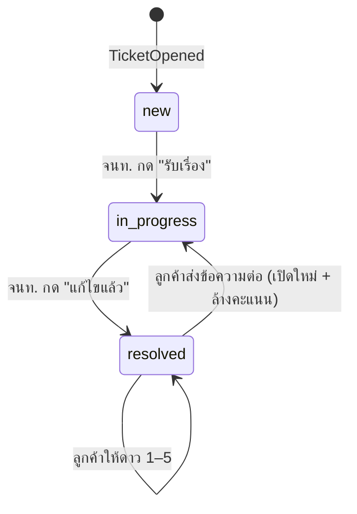
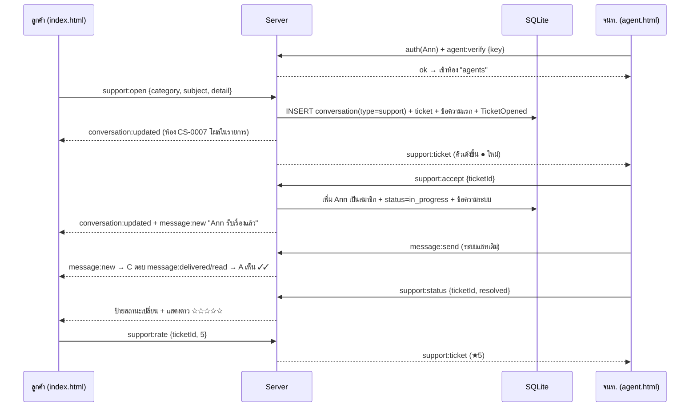
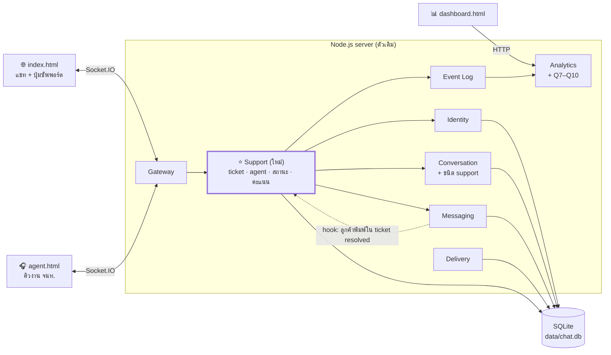
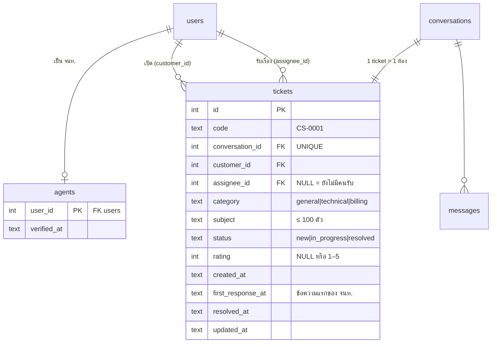

# Sapol Chat + Support — แผน PDCA รอบที่ 4 (P)

> 26 ก.ย. 2026 · ต่อจากรอบที่ 3 (`PLAN-R3.md`) · สถานะ: **Plan** (รออนุมัติก่อน Do)
> โจทย์: **รวมระบบ Customer Support เข้ากับ Sapol Chat** ให้เป็นโปรแกรมเดียว
> เงื่อนไข: ใช้ในการเรียน ไม่ซับซ้อน ทำเสร็จภายใน **2 ชั่วโมง** · เขียนโค้ดใน VS Code
> แนวทางออกแบบเหมือนรอบ 3: **Business Questions → Domain Events → Logical Components**
> (แผนนี้ใช้แทน `customer-support/docs/PLAN.md` ที่เคยวางไว้เป็นโปรแกรมแยก)

---

## 0. แนวคิดการรวม

**Ticket 1 ใบ = conversation 1 ห้อง ชนิดใหม่ `support`** แล้วใช้ของที่ระบบแชทมีอยู่แล้วทั้งหมด

| ของที่ Support ต้องใช้ | ใช้ของเดิมจาก Sapol Chat | ต้องเพิ่มใหม่ |
|---|---|---|
| ตัวตนลูกค้า / เจ้าหน้าที่ | Identity (username เดิม = คนเดิม) | ตาราง `agents` บอกว่าใครเป็นเจ้าหน้าที่ |
| ห้องคุยของแต่ละ ticket | Conversation + members | ชนิด `support` + ตาราง `tickets` |
| ส่ง/รับข้อความ, ประวัติ, "กำลังพิมพ์…" | Messaging, History, typing | – |
| ✓ ✓✓ อ่านแล้ว, ส่งตอนอีกฝ่าย offline | Delivery & Receipts | – |
| สถิติ | Event Log + Analytics + dashboard | event ใหม่ 4 ตัว + ตัวชี้วัด Q7–Q10 |
| คิวงานเจ้าหน้าที่, สถานะ, ให้คะแนน | – | โมดูล `src/support.js` + หน้า `agent.html` |

**ข้อดีที่ได้เรียนรู้:** เห็นประโยชน์ของการแยก component ในรอบ 3 — ฟีเจอร์ใหม่ทั้งระบบเพิ่มได้โดยแทบไม่ต้องแก้ส่วนส่งข้อความ

## 1. ผู้ใช้ (Actor)

| ผู้ใช้ | คือใคร | ทำอะไรได้ |
|---|---|---|
| **ลูกค้า** | ผู้ใช้แชททุกคน | กดปุ่ม "🎧 ติดต่อซัพพอร์ต" เปิด ticket, คุยใน ticket, ให้คะแนน |
| **เจ้าหน้าที่ (Agent)** | ผู้ใช้แชทที่ยืนยันรหัส `AGENT_KEY` แล้ว 1 ครั้ง | เห็นคิว ticket, รับเรื่อง, ตอบ, เปลี่ยนสถานะ — และยังแชทปกติได้ |

## 2. ขอบเขต

| ทำ (6 ฟีเจอร์) | ไม่ทำ (รอบนี้) |
|---|---|
| **S1** ปุ่ม "🎧 ติดต่อซัพพอร์ต" ในหน้าแชท → ฟอร์ม หมวด/หัวข้อ/รายละเอียด → ได้ ticket `CS-0001` ซึ่งโผล่เป็นห้องในรายการแชทของลูกค้า พร้อมป้ายสถานะ | ลูกค้าที่ไม่ได้เป็นผู้ใช้แชท / อีเมล |
| **S2** คุยใน ticket ด้วยระบบแชทเดิมทั้งหมด (ประวัติ, ✓✓, offline, กำลังพิมพ์…) | แนบไฟล์ / รูป |
| **S3** หน้าเจ้าหน้าที่ `agent.html`: ยืนยันรหัส → คิว ticket กรองตามสถานะ อัปเดตเรียลไทม์ → ดูตัวอย่าง → กด **"รับเรื่อง"** แล้วเข้าห้อง ticket | กระจายงานอัตโนมัติ, SLA, โอนเรื่องให้คนอื่น |
| **S4** สถานะ `ใหม่ → กำลังดำเนินการ → แก้ไขแล้ว` (ลูกค้าพิมพ์ต่อ = เปิดใหม่) ทุกครั้งมีข้อความระบบในห้อง | สถานะ "ปิดถาวร" |
| **S5** เมื่อ "แก้ไขแล้ว" ลูกค้าให้คะแนน 1–5 ดาว | ความคิดเห็นแบบข้อความ |
| **S6** dashboard เพิ่มหมวด Support ตอบ Q7–Q10 | กราฟแยกรายเจ้าหน้าที่ |

**ความปลอดภัยขั้นต่ำ (เพิ่มจากเดิม)**

1. ข้อความทุกชนิดแสดงด้วย `textContent` (เหมือนเดิม)
2. ลูกค้าเห็นเฉพาะ ticket ที่ตัวเองเป็นสมาชิก — ใช้การตรวจ `isMember` เดิม
3. คำสั่ง `support:queue / accept / status` ตรวจว่าเป็นเจ้าหน้าที่ทุกครั้งที่ server (ไม่เชื่อฝั่งหน้าเว็บ)
4. `AGENT_KEY` อ่านจาก environment (ค่าเริ่มต้น `agent123` สำหรับเรียน) และไม่ส่งกลับไปหน้าเว็บ
5. ข้อจำกัดที่รู้อยู่: ระบบยังไม่มีรหัสผ่านผู้ใช้ ใครพิมพ์ username ของเจ้าหน้าที่ก็เข้าในนามนั้นได้ (แก้ในรอบล็อกอินจริง)

---

## 3. Business Questions → ตัวชี้วัด (ต่อจาก Q1–Q6)

| # | คำถาม | นิยามที่วัดได้ | ต้องรู้เหตุการณ์ |
|---|---|---|---|
| Q7 | มี ticket ใหม่กี่ใบต่อวัน แยกหมวด? | จำนวน `TicketOpened` ต่อวัน × category | TicketOpened |
| Q8 | ลูกค้ารอคำตอบแรกนานเท่าไร? (First Response Time) | `เวลาข้อความแรกของ จนท. − เวลาเปิด ticket` รายงาน p50 / p95 | TicketOpened, MessageSent (sender เป็น agent) |
| Q9 | ใช้เวลาแก้ปัญหานานเท่าไร? | `resolved ครั้งล่าสุด − เวลาเปิด` p50 · และจำนวน ticket ค้าง (ยังไม่ resolved) | TicketStatusChanged |
| Q10 | ลูกค้าพอใจแค่ไหน? (CSAT) | ค่าเฉลี่ยดาว และ % ที่ให้ 4–5 ดาว | TicketRated |

## 4. Domain Events (เพิ่มใหม่)

| Event | เกิดเมื่อ | ข้อมูลสำคัญ | ตอบคำถาม |
|---|---|---|---|
| `AgentVerified` | ผู้ใช้ยืนยันรหัสเจ้าหน้าที่สำเร็จ | userId | – |
| `TicketOpened` | ลูกค้าส่งฟอร์ม | ticketId, conversationId, category | Q7 Q8 Q9 |
| `TicketAccepted` | จนท. กดรับเรื่อง | ticketId, agentId | Q8 |
| `TicketStatusChanged` | สถานะเปลี่ยน | ticketId, from, to, byUserId | Q9 |
| `TicketRated` | ลูกค้าให้ดาว | ticketId, rating | Q10 |

### 4.1 วงจรสถานะ ticket



### 4.2 Flow หลัก



## 5. Logical Components



| Component | เปลี่ยนอะไร | ไฟล์ |
|---|---|---|
| **Support** (ใหม่) | ยืนยัน จนท., เปิด ticket, คิว, รับเรื่อง, เปลี่ยนสถานะ, ให้คะแนน, ข้อความระบบ | `src/support.js` |
| Conversation | รองรับ `type = 'support'`, `view()` แนบข้อมูล ticket (code, status, rating), ห้าม `addMember/removeMember` ห้อง support ด้วยคำสั่งกลุ่มปกติ | `src/conversation.js` |
| Messaging | รองรับ `content_type = 'system'` (ส่งโดย server เท่านั้น) + ฟังก์ชัน `onSent(fn)` ให้ support ลงทะเบียน callback (ไม่ require support.js เพื่อกันวงวน — ดู `DEPENDENCIES.md` ข้อ 4) | `src/messaging.js` |
| Gateway | เพิ่ม handler `agent:verify`, `support:*` และส่ง `support:ticket` เข้าห้อง `agents` | `src/server.js` |
| Database | ตาราง `agents`, `tickets` + **migration** ขยาย CHECK ของ `conversations.type` | `src/db.js` |
| Analytics | เพิ่ม `support` ใน `/api/metrics` | `src/analytics.js`, `public/dashboard.html` |

### 5.1 ฐานข้อมูล (เพิ่ม)



**Migration:** ตาราง `conversations` เดิมมี `CHECK (type IN ('direct','group'))` ซึ่ง SQLite แก้ตรง ๆ ไม่ได้ → ใน `db.js` ตรวจว่า SQL ของตารางยังไม่มีคำว่า `support` ถ้าไม่มีให้ **สร้างตารางใหม่ → คัดลอกข้อมูล → สลับชื่อ** ภายใน transaction (ข้อมูลแชทเดิมใน `data/chat.db` ต้องอยู่ครบ)

### 5.2 Socket.IO Events (เพิ่ม)

| ทิศทาง | Event | ข้อมูล | ใครใช้ได้ |
|---|---|---|---|
| → server | `agent:verify` | `{key}` → ack `{ok}` | ทุกคน (หลัง auth) |
| → server | `support:open` | `{category, subject, detail}` → ack `{ticket, conversation}` | ทุกคน |
| → server | `support:queue` | `{status?}` → ack `{tickets}` | จนท. |
| → server | `support:preview` | `{ticketId}` → ack `{ticket, messages}` | จนท. |
| → server | `support:accept` | `{ticketId}` | จนท. |
| → server | `support:status` | `{ticketId, status}` | จนท. ที่รับเรื่อง |
| → server | `support:rate` | `{ticketId, rating}` | ลูกค้าเจ้าของ ticket (เฉพาะ resolved) |
| server → `agents` | `support:ticket` | ข้อมูลย่อ ticket | เมื่อเปิด/รับ/เปลี่ยนสถานะ/ให้ดาว/ข้อความใหม่ |
| server → สมาชิก | `conversation:updated`, `message:new` | (ของเดิม) | ป้ายสถานะ + ข้อความระบบ |

### 5.3 หน้าจอ

```
┌─ index.html (แชทเดิม + ส่วนเพิ่ม) ──────────────────────────────────────┐
│ Sapol Chat · HAT                          [🎧 ติดต่อซัพพอร์ต]           │
├─────────────────────────┬──────────────────────────────────────────────┤
│ # general               │ 🎧 CS-0007 เข้าเว็บไม่ได้     [กำลังดำเนินการ]  │
│ Ann ●                   │ — Ann รับเรื่องแล้ว —                          │
│ 🎧 CS-0007  กำลังดำเนินการ│ Ann 10:05  ลองล้างแคชดูครับ                  │
│ 🎧 CS-0003  แก้ไขแล้ว ★5  │                     ได้แล้วครับ 10:06 ✓✓      │
│                         │ (เมื่อแก้ไขแล้ว) ให้คะแนน ☆☆☆☆☆                 │
│                         │ [ พิมพ์ข้อความ...                ] [ส่ง]      │
└─────────────────────────┴──────────────────────────────────────────────┘

┌─ agent.html (ใหม่) ─────────────────────────────────────────────────────┐
│ Sapol Support · จนท. Ann                        [เปิดหน้าแชท ↗]          │
│ [ทั้งหมด] [ใหม่ 2] [กำลังดำเนินการ] [แก้ไขแล้ว]                            │
├──────────────────────────────┬─────────────────────────────────────────┤
│ ● CS-0008 ชำระเงินไม่ผ่าน ใหม่ │ CS-0008 · HAT · การชำระเงิน · 10:12      │
│   CS-0007 เข้าเว็บไม่ได้ (1)   │ HAT: ตัดบัตรแล้วแต่ยอดไม่เข้า             │
│   CS-0003 ขอใบเสร็จ  ★5       │ [ รับเรื่อง ]  (รับแล้ว → แชท + ปุ่มสถานะ) │
└──────────────────────────────┴─────────────────────────────────────────┘
```

`agent.html` ใช้ socket ชุดเดียวกับหน้าแชท: เข้าด้วย username → ยืนยันรหัส → คุยในแชทของ ticket ได้เลยในหน้าเดียว

### 5.4 ไฟล์ที่แตะ

```
Sapol Chat system/
├── docs/PLAN-R4.md            ← ไฟล์นี้
├── src/support.js             ← ใหม่ (~150 บรรทัด)
├── src/db.js                  ← + agents, tickets, migration
├── src/conversation.js        ← + ชนิด support
├── src/messaging.js           ← + ข้อความ system + hook
├── src/server.js              ← + handler support
├── src/analytics.js           ← + Q7–Q10
├── public/index.html          ← + ปุ่ม/ฟอร์ม, ป้ายสถานะ, ดาว
├── public/agent.html          ← ใหม่
├── public/dashboard.html      ← + หมวด Support
└── test/support.test.js       ← ใหม่
```

---

## 6. แผนการทำงาน (ขั้น Do) — รวม 120 นาที

| นาทีที่ | งาน | เสร็จเมื่อ |
|---|---|---|
| 0–5 | `git commit` สถานะเดิม + สำรอง `data/chat.db` | มีจุดย้อนกลับ |
| 5–20 | `db.js`: ตารางใหม่ + migration | รัน server กับฐานเดิมแล้วแชทเก่ายังอยู่ |
| 20–45 | `support.js` + แก้ `conversation.js` / `messaging.js` | ฟังก์ชันเปิด/รับ/สถานะ/ดาว ทำงานใน test |
| 45–55 | `server.js` handler ตามข้อ 5.2 | `npm test` เดิมยังผ่านทั้งหมด |
| 55–75 | `index.html`: ปุ่ม + ฟอร์ม, ไอคอน 🎧 + ป้ายสถานะ, ดาว | ลูกค้าเปิด ticket และคุยได้ |
| 75–95 | `agent.html`: ยืนยันรหัส, คิว, ตัวอย่าง, รับเรื่อง, แชท, ปุ่มสถานะ | จนท. ทำงานครบวงจร |
| 95–105 | `analytics.js` + `dashboard.html` Q7–Q10 | เห็นตัวเลข Support |
| 105–120 | `test/support.test.js` + ทดสอบในเบราว์เซอร์ตามข้อ 7 | ผ่านครบ |

## 7. เกณฑ์ตรวจสอบ (สำหรับขั้น Check)

| # | ทดสอบ | ผ่านเมื่อ | ฟีเจอร์ |
|---|---|---|---|
| 13 | กดติดต่อซัพพอร์ต กรอกครบแล้วส่ง | ได้ห้อง `CS-xxxx` ในรายการแชท สถานะ "ใหม่" | S1 |
| 14 | ส่งฟอร์มเว้นหัวข้อ / หัวข้อยาวเกิน 100 | ขึ้นคำเตือน ไม่สร้าง ticket | S1 |
| 15 | เปิด agent.html ไว้ แล้วลูกค้าเปิด ticket | คิวเด้งขึ้นทันที | S3 |
| 16 | ใส่รหัส จนท. ผิด / ผู้ใช้ทั่วไปส่ง `support:queue` เอง | ถูกปฏิเสธ | ความปลอดภัย |
| 17 | จนท. กดรับเรื่อง | ลูกค้าเห็น "Ann รับเรื่องแล้ว" สถานะเป็น "กำลังดำเนินการ" | S3 S4 |
| 18 | คุยสลับกัน / ลูกค้า offline แล้วกลับมา | เห็นทันที, ✓✓ ทำงาน, ข้อความค้างถูกส่งเมื่อกลับมา | S2 |
| 19 | จนท. กด "แก้ไขแล้ว" → ลูกค้าให้ 4 ดาว | คิว จนท. แสดง ★4 | S4 S5 |
| 20 | ลูกค้าพิมพ์ต่อหลังแก้ไขแล้ว | กลับเป็น "กำลังดำเนินการ" ดาวถูกล้าง | S4 |
| 21 | ผู้ใช้คนอื่นพยายามส่งข้อความ/ให้ดาวใน ticket ที่ไม่ใช่ของตัวเอง | ถูกปฏิเสธ | ความปลอดภัย |
| 22 | เปิด dashboard | เห็น Q7–Q10 ตรงกับข้อมูลทดสอบ | S6 |
| 23 | ส่ง `` เป็นหัวข้อ ticket | แสดงเป็นตัวอักษร | ความปลอดภัย |
| 24 | **Regression:** `npm test` ของรอบ 3 + แชทเก่าใน `data/chat.db` | ผ่านทั้งหมด ข้อมูลเดิมไม่หาย | – |

## 8. ความเสี่ยง

| ความเสี่ยง | แนวทาง |
|---|---|
| Migration ทำข้อมูลแชทเดิมเสีย | สำรอง `data/chat.db` ก่อน + ทำใน transaction + ทดสอบ #24 |
| ห้อง support ไปโผล่ในคำสั่งกลุ่ม (เพิ่ม/ลบสมาชิก, ออกจากห้อง) | ตรวจ `type` ใน `conversation.js` และซ่อนปุ่มในหน้าเว็บ |
| `index.html` ยาวแล้ว (532 บรรทัด) แก้ยาก | เพิ่มเฉพาะส่วน support เป็นบล็อกแยก มีหัวคอมเมนต์ชัดเจน |
| เวลาไม่พอ | ตัด S6 (dashboard) ก่อน แล้วค่อย S5 (ดาว) ย้ายไปรอบถัดไป |

## 9. ขั้น Act (รอบถัดไป)

ระดับความสำคัญ (priority) → ข้อความตอบกลับสำเร็จรูป → โอนเรื่องให้ จนท. คนอื่น → แจ้งเตือน ticket ที่รอเกินกำหนด (SLA) → ล็อกอินจริงด้วยรหัสผ่าน → แนบรูป/ไฟล์

---

### ✅ เช็กลิสต์ก่อนเริ่ม Do

- [ ] ยอมรับแนวคิด "ticket = ห้องแชทชนิด support" และขอบเขต 6 ฟีเจอร์
- [ ] รหัส จนท. เริ่มต้น `agent123`, ใช้พอร์ตเดิม 3000
- [ ] ยอมรับข้อจำกัด: ยังไม่มีรหัสผ่านผู้ใช้
