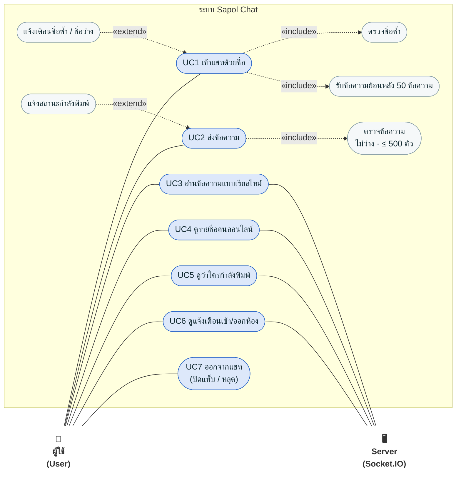

# Sapol Chat — Use Case Diagram

> อ้างอิงฟีเจอร์ PDCA รอบที่ 1–2 (F1–F6) · Mermaid ยังไม่มีชนิด use case โดยตรง จึงวาดด้วย `flowchart`
> ตามรูปแบบ UML: 👤 = Actor, `( … )` = Use case, กรอบใหญ่ = ขอบเขตระบบ

## คำอธิบาย Use case

| รหัส | Use case | Actor | ฟีเจอร์ | เงื่อนไข / ผลลัพธ์ |
|---|---|---|---|---|
| UC1 | เข้าแชทด้วยชื่อ | ผู้ใช้ | F1, F5 | ชื่อ 1–20 ตัว ห้ามซ้ำคนออนไลน์ (ไม่สนตัวพิมพ์เล็ก/ใหญ่) · สำเร็จแล้วได้ข้อความย้อนหลัง |
| UC2 | ส่งข้อความ | ผู้ใช้ | F2 | ต้องเข้าแชทก่อน · ข้อความว่างถูกทิ้ง · ยาวเกิน 500 ตัวถูกตัด |
| UC3 | อ่านข้อความแบบเรียลไทม์ | ผู้ใช้, Server | F2 | ทุกคนได้รับข้อความทันที รวมคนส่ง |
| UC4 | ดูรายชื่อคนออนไลน์ | ผู้ใช้, Server | F4 | อัปเดตทุกครั้งที่มีคนเข้า/ออก |
| UC5 | ดูว่าใครกำลังพิมพ์ | ผู้ใช้, Server | F6 | ไม่เห็นของตัวเอง · หายเมื่อเงียบ 1.5 วิ หรือส่งแล้ว |
| UC6 | ดูแจ้งเตือนเข้า/ออกห้อง | ผู้ใช้, Server | F3 | "xxx เข้าห้อง" / "xxx ออกจากห้อง" |
| UC7 | ออกจากแชท | ผู้ใช้ | F3, F4 | ชื่อถูกลบจากรายชื่อ ใช้ชื่อนี้ใหม่ได้ · ล้างสถานะกำลังพิมพ์ |

**«include»** = ทำทุกครั้ง (เข้าแชท → ต้องตรวจชื่อเสมอ)
**«extend»** = เกิดเฉพาะบางกรณี (แจ้งเตือนเมื่อชื่อซ้ำ, แจ้งกำลังพิมพ์ระหว่างพิมพ์)
